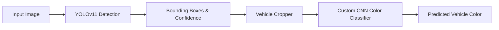

# TEPEE Hackathon - Vehicle Detection & Color Recognition

An end-to-end computer vision and deep learning system that detects vehicles in images and classifies their colors using a two-stage deep learning pipeline.

---

## Architecture & Pipeline



1. **Vehicle Detection (`src/detector.py`)**: Uses Ultralytics YOLOv11 Nano (`models/yolo11n.pt` / `yolo11n.pt`) to locate vehicles with bounding boxes and confidence scores.
2. **Cropping & Visualization (`src/visualizer.py`)**: Crops each detected vehicle from the scene and generates an annotated output image with labeled bounding boxes.
3. **Color Classification (`src/analyzer.py`)**: Feeds cropped vehicle images into a TensorFlow CNN model (`models/car_color_model.keras` / `car_color_model.keras`) to predict vehicle color across 15 distinct categories.

---

## Color Categories (15 Classes)

The color recognition model classifies vehicles into 15 color classes:
`beige`, `black`, `blue`, `brown`, `gold`, `green`, `grey`, `orange`, `pink`, `purple`, `red`, `silver`, `tan`, `white`, `yellow`.

---

## Requirements & Environment Setup

- Python 3.10+ (tested on Python 3.13)
- Windows / Linux / macOS

### Quick Setup

```powershell
# Create virtual environment
python -m venv .venv

# Activate virtual environment (Windows PowerShell)
.venv\Scripts\Activate.ps1

# Install project dependencies
pip install -r requirements.txt
```

> [!NOTE]
> If using the pre-configured `.vehicle_analyze` virtual environment, you can run directly using `.vehicle_analyze\Scripts\python.exe`.

---

## Usage

### 1. Run the Application Entry Point

To run the main application and predict the color of a sample vehicle crop:

```powershell
python src/main.py
```

*Default behavior:* Clears console, loads `car_color_model.keras`, processes `test/cropped_car_7.png`, and prints the predicted color class index and name (e.g. `black`).

### 2. Vehicle Detection & Cropping

To execute vehicle detection and generate cropped vehicle images:

```python
from main import Main

app = Main()
detections = app.identify_objects("test/test_image.png")
```

This outputs:
- `test/output_image.png`: Full image with red bounding boxes and confidence scores.
- `test/cropped_car_<i>.png`: Extracted vehicle crops for downstream color analysis.

### 3. Inspect Color Dataset

To preview 25 random samples from any color category in the dataset:

```powershell
python src/visualizer.py
```

---

## Model Training

To retrain the vehicle color classification model from scratch using TensorFlow:

```powershell
python src/train.py
```

### Training Specifications
- **Dataset**: `dataset/Car_colors/train` and `dataset/Car_colors/val`
- **Input Resolution**: `224 x 224 x 3` (normalized to `[0, 1]`)
- **Batch Size**: 32
- **Epochs**: 10
- **Optimizer**: Adam
- **Loss**: Categorical Crossentropy
- **Output Artifact**: `car_color_model.keras`

---

## Running Automated Tests

Run the test suite using `pytest`:

```powershell
pytest -v
```

All test cases are located in the [`tests/`](tests/README.md) directory. `conftest.py` ensures all `src/` modules are discoverable.

---

## Dataset Setup

The vehicle color recognition dataset can be obtained from Kaggle:
- **Kaggle Link**: [Vehicle Color Recognition Dataset](https://www.kaggle.com/datasets/seebicb/vehicle-color-recognition/data)

Expected folder layout:

```text
dataset/
├── Car_colors/
│   ├── train/     # 15 color folders with training images
│   ├── val/       # 15 color folders with validation images
│   └── test/      # 15 color folders with test images
├── data.yaml      # YOLO dataset configuration
├── images/        # Detection images (train/val)
└── labels/        # Detection annotations (train/val/test)
```

See [`dataset/README.md`](dataset/README.md) for full dataset specifications.

---

## Project Structure

```text
TEPEE-HACKATHON/
├── dataset/                    # Training and validation datasets
│   ├── Car_colors/             # 15 vehicle color category folders
│   ├── data.yaml               # YOLO dataset configuration
│   ├── images/                 # YOLO images
│   ├── labels/                 # YOLO annotations
│   └── README.md               # Dataset documentation
├── models/                     # Trained models and weights
│   ├── car_color_model.keras   # 15-class vehicle color CNN
│   ├── yolo11n.pt              # YOLOv11 Nano detector weights
│   └── README.md               # Model specifications and notes
├── results/                    # Generated outputs and graphs
│   ├── graphs/                 # Training curves and metrics
│   ├── predictions/            # Evaluation and prediction logs
│   └── README.md               # Results documentation
├── src/                        # Core source code (untouched)
│   ├── __init__.py
│   ├── analyzer.py             # Model inference & class mapping
│   ├── detector.py             # YOLO object detection
│   ├── loader.py               # Path resolution & image saving
│   ├── main.py                 # Application entry point
│   ├── train.py                # TensorFlow CNN training pipeline
│   └── visualizer.py           # Bounding box & dataset visualizer
├── test/                       # Sample test image assets and fixtures
│   ├── test_image.png          # Input sample image
│   ├── output_image.png        # Annotated detection image
│   ├── cropped_car_*.png       # Cropped vehicle patches
│   └── README.md               # Test assets documentation
├── tests/                      # Automated unit and integration tests
│   ├── __init__.py
│   ├── conftest.py             # Pytest configuration and sys.path setup
│   ├── test_detector.py        # Detector tests
│   └── README.md               # Test suite documentation
├── .gitattributes              # Line endings and Git LFS rules
├── .gitignore                  # Git ignore rules for models, venvs, outputs
├── conftest.py                 # Root pytest configuration
├── requirements.txt            # Project dependencies
└── README.md                   # Main documentation
```

---

## Git & Large Model Handling

- Large model weights (`*.keras`, `*.pt`, `*.onnx`) are configured in `.gitattributes` for tracking with [Git LFS](https://git-lfs.github.com/).
- Standard generated outputs and virtual environments (`.vehicle_analyze/`, `myenv/`) are safely ignored in `.gitignore`.
